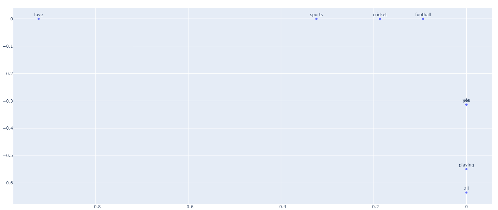

# Count-based word embedding
A small project inspired by a lecture at University of Bicocca. 
First word embedding of mine, using [SVD](https://en.wikipedia.org/wiki/Singular_value_decomposition).

Here is a plot of the similarity of a short text, showing the potential of the SVD word embedding.
